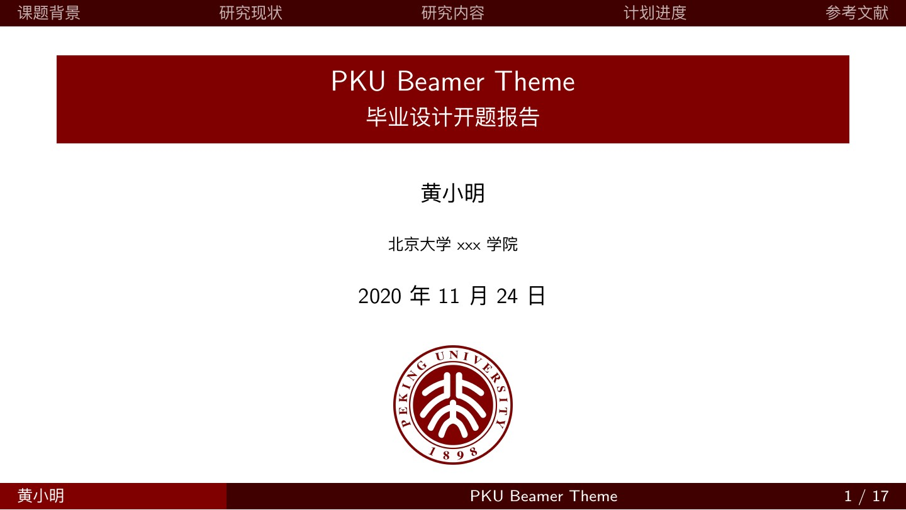
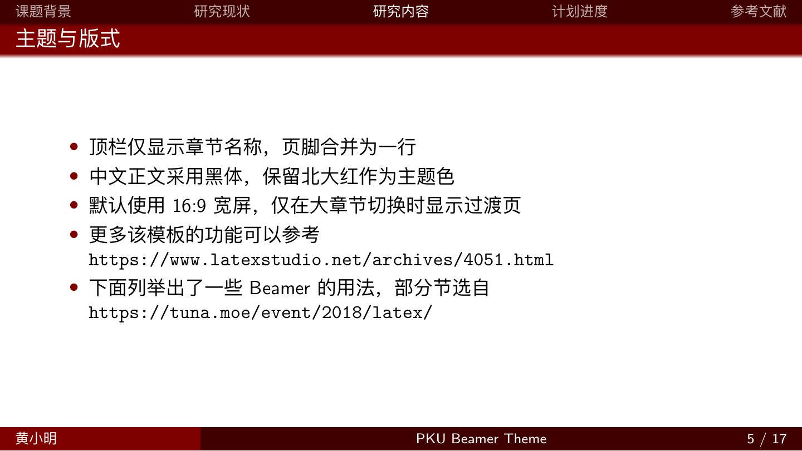
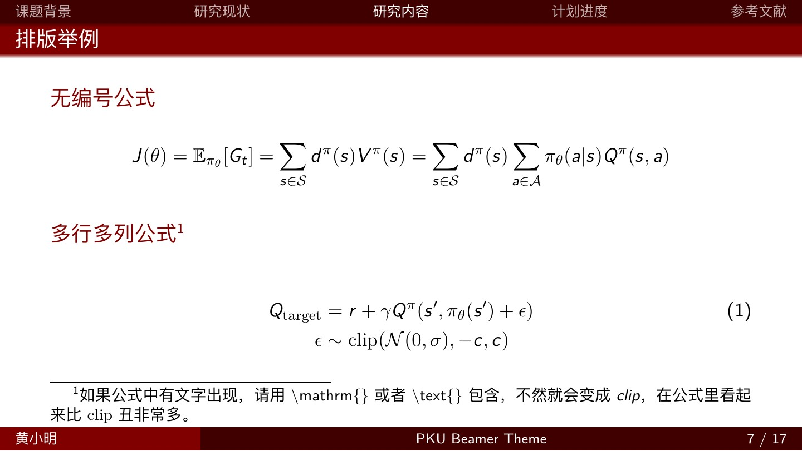
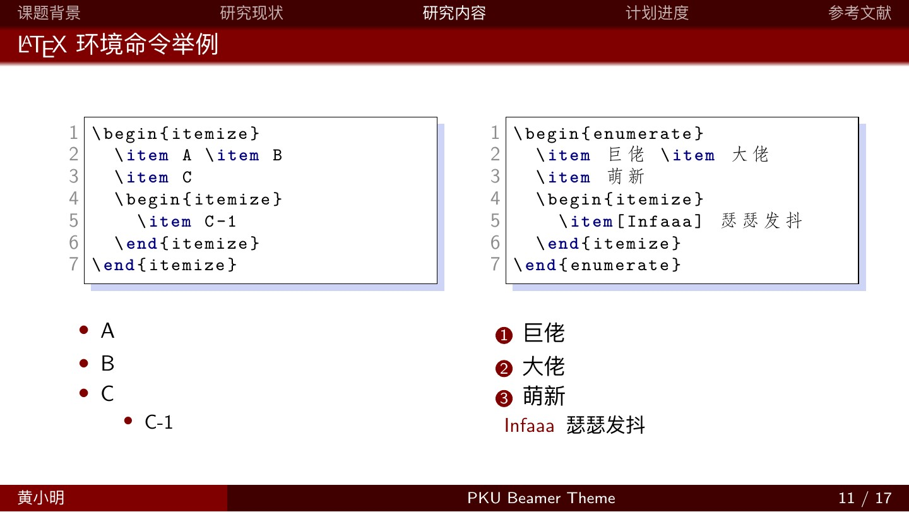

# PKU-Beamer-Theme

北京大学 Beamer 主题，适用于学术报告、毕业答辩和日常分享。

[查看示例与教程 PDF](How_to_do_pku_beamer_theme.pdf) · [Overleaf 模板](https://www.overleaf.com/latex/templates/pku-beamer-theme/zdnpwpfnkzcc) (Old Version)

当前示例采用 **16:9 宽屏、中文黑体正文、单行章节导航和双色红色页脚**，保留标题渐变与阴影。已修复顶栏上沿的白边；仅在章节切换时显示简短过渡页，小节不重复插入目录，过渡页不计入页脚页数。

## 快速使用

下载或克隆完整仓库，修改 `slide.tex` 中的标题、作者、院系和正文，使用 **XeLaTeX** 编译。图片放在 `pic/`，参考文献放在 `ref.bib`。

本地编译需要已安装的 **XeLaTeX 和 BibTeX**。如果本机有 `make`，在仓库目录运行：

```sh
make
```

生成的报告位于 `build/slide.pdf`，编译中间文件也保存在 `build/`。没有 `make` 时，可以直接运行：

```sh
xelatex slide.tex
bibtex slide
xelatex slide.tex
xelatex slide.tex
```

这组命令输出根目录下的 `slide.pdf`。无参考文献的文件连续运行两次 XeLaTeX 即可，第二次用于补齐导航和总页数。

在 Overleaf 中上传仓库文件，将主文件设为 `slide.tex`，编译器选为 **XeLaTeX**。中文字体由 `ctex` 根据环境选择，无需填写本机字体路径。上方在线模板可作为起点；使用本仓库的当前版式时，请上传这里的文件。

完整教程含 PSTricks 绘图和代码示例，需要 `ctex`、`pstricks`、`listings`、`stackengine` 等宏包。若精简 TeX 环境提示缺少 `.sty`，按报错补齐对应宏包，或先使用下面的最小示例。

## 最小示例

从空白文件开始时，将 `PekingU.sty` 放在同一目录，保存以下内容为 `.tex` 文件，用 XeLaTeX 编译：

```tex
\documentclass[aspectratio=169]{beamer}
\usepackage{ctex}
\usepackage{PekingU}

\title[报告短标题]{完整报告标题}
\author{姓名}
\institute{北京大学}
\date{\today}

\begin{document}
\begin{frame}
  \titlepage
\end{frame}

\section{研究背景}
\begin{frame}{研究问题}
  \begin{itemize}
    \item 在这里填写正文。
  \end{itemize}
\end{frame}
\end{document}
```

常用调整：

- **页脚文字过长**：使用 `\title[短标题]{完整标题}`、`\author[报告人]{完整作者名单}`。
- **顶栏章节太多或太长**：精简章节，或使用 `\section[短节名]{完整章节标题}`。
- **需要 4:3**：把 `aspectratio=169` 改为 `aspectratio=43`，并检查图表宽度。
- **只改报告内容**：编辑 `slide.tex`；主题颜色、导航和页脚样式集中在 `PekingU.sty`。

## 预览

以下图片来自当前 `slide.tex`，完整示例见 [教程 PDF](How_to_do_pku_beamer_theme.pdf)。

 
 

## Codex / Claude Code Skills

仓库提供四个可复用的 LaTeX 技能，使用当前助手的文件编辑、视觉与检索能力，不要求额外 API Key；本地编译仍需 TeX 环境，在线核对文献仍需网络访问。

| 技能 | 用途 | Codex 调用 | Claude Code 调用 |
| --- | --- | --- | --- |
| [latex-tables](.agents/skills/latex-tables/SKILL.md) | 将 CSV、Markdown 或粘贴数据做成 LaTeX 表格，保留精度，适配页宽 | `$latex-tables` | `/latex-tables` |
| [latex-equations](.agents/skills/latex-equations/SKILL.md) | 将文字或公式图片转成 LaTeX，处理对齐、编号和断行 | `$latex-equations` | `/latex-equations` |
| [latex-bibtex](.agents/skills/latex-bibtex/SKILL.md) | 从题名、DOI 或链接核对 BibTeX，补充字段、去重并保留引用键 | `$latex-bibtex` | `/latex-bibtex` |
| [latex-figures](.agents/skills/latex-figures/SKILL.md) | 插入已有图片，调整分栏、图注与交叉引用，检查比例和溢出 | `$latex-figures` | `/latex-figures` |

从本仓库打开 Codex 或 Claude Code 会话，即可按需调用。**Windows 或 ZIP 下载用户**：如果 `.claude/skills/` 中的入口无法识别，请用 `.agents/skills/` 中的四个实际技能文件夹替换它们；Codex 直接读取 `.agents/skills/`。

例如，将文件名和目标页换成自己的内容：

```text
使用 $latex-tables，把 results.csv 放进 slide.tex 的实验结果页，
做成三线表，保留原始小数位，并检查是否超出页面。
```

在 Claude Code 中输入：

```text
/latex-tables 把 results.csv 放进 slide.tex 的实验结果页，做成三线表，保留原始小数位，并检查是否超出页面。
```

也可以用自然语言描述任务，让助手按描述选择技能。处理模糊公式图片时会标出无法确认的符号；整理文献时会说明未验证的字段，不凭空补作者或年份。

技能正文统一保存在 `.agents/skills/`，供 Codex 发现；`.claude/skills/` 通过相对符号链接复用同一份内容，修改时只需维护前者。需要用于其他项目时，将所需技能文件夹复制到目标项目的对应目录即可，复制到 `.claude/skills/` 时请复制实际文件夹。

技能未出现时，Codex 可重启会话；Claude Code 可运行 `/reload-skills`。加载与目录规则见 [Codex 官方文档](https://learn.chatgpt.com/docs/build-skills) 和 [Claude Code 官方文档](https://code.claude.com/docs/en/skills)。

## 可选在线工具

习惯手工操作时，仍可使用原来的工具；上面的技能不依赖这些网站的付费 API。

- [Tables Generator](https://www.tablesgenerator.com/)：可视化编辑表格并导出 LaTeX。
- [Mathpix](https://mathpix.com/)：识别公式图片并转换为 LaTeX。
- [DBLP](https://dblp.uni-trier.de/)：检索计算机领域论文及 BibTeX。
- [LaTeX 图、表与图注说明](https://en.wikibooks.org/wiki/LaTeX/Floats,_Figures_and_Captions#Tip)：查阅浮动体、插图和图注用法。

## 文件说明

| 路径 | 内容 |
| --- | --- |
| `slide.tex` | 可直接修改的报告与教程源码 |
| `PekingU.sty` | 北大主题样式 |
| `ref.bib` | 示例参考文献 |
| `pic/` | 报告使用的图片 |
| `img/` | README 预览图片 |
| `How_to_do_pku_beamer_theme.pdf` | 从当前源码编译的示例与教程 |
| `Makefile` | 可选的一键编译、教程更新和清理命令 |
| `.agents/skills/` | 四个技能的正文及 Codex 界面配置 |
| `.claude/skills/` | Claude Code 技能入口 |

## 维护与发布

修改示例或主题后，运行 `make tutorial` 重新编译并更新仓库中的 `How_to_do_pku_beamer_theme.pdf`，检查版面后再提交。README 预览图分别对应 PDF 的封面、主题说明、公式和代码示例页，版式变化时同步更新 `img/` 中的对应图片。

`make clean` 清理 `build/`，保留源码与随附教程。`.gitignore` 已排除编译中间文件、本机编辑器设置和 `output/` 下的本地对比产物；发布时保留 `.agents/` 和 `.claude/`，以便技能随仓库一起分发。

## 致谢

本项目基于 [TUNA / THU-Beamer-Theme](https://github.com/tuna/THU-Beamer-Theme) 修改。相关主题实现与历史背景可参考上游项目。
